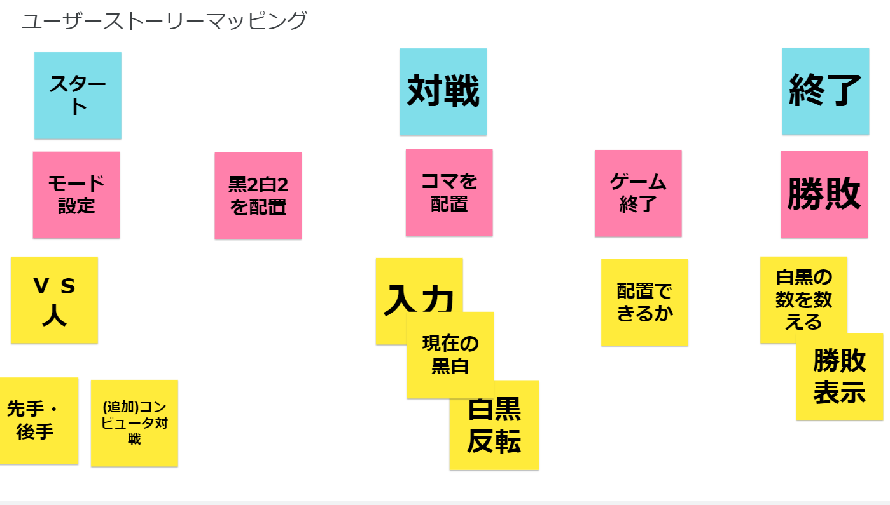

# Reversi

## Start
```
go run board.go
```

## User story mapping


## Product Backlog
* モード設定機能の実現（VS 人）
* 先手と後手を選択
* 黒２白２を配置
* コマを配置
* 黒白反転判定
* 入力した後、チェス盤を更新
* プレイヤーを交換
* 配置できるかどうか判定
* ゲーム終了条件判定
* 白黒の数を数えると、勝敗評価
* (追加)コンピュータ対戦
* simple AIは、ランダムにコマを配置する
* normal AIは、the current position that can flip the maximum number of opponent's pieces of different colors
* hard AIは、ミニマックス法でゲーム木探索を行い、指定されたレベル数を探索した後に最適解を返す


## Scrum

### Scrum 1


### Scrum 2


### Scrum 3
